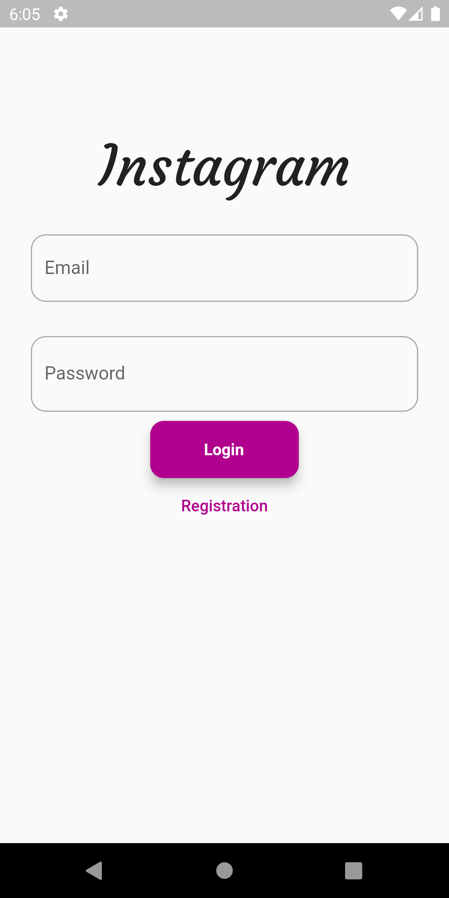
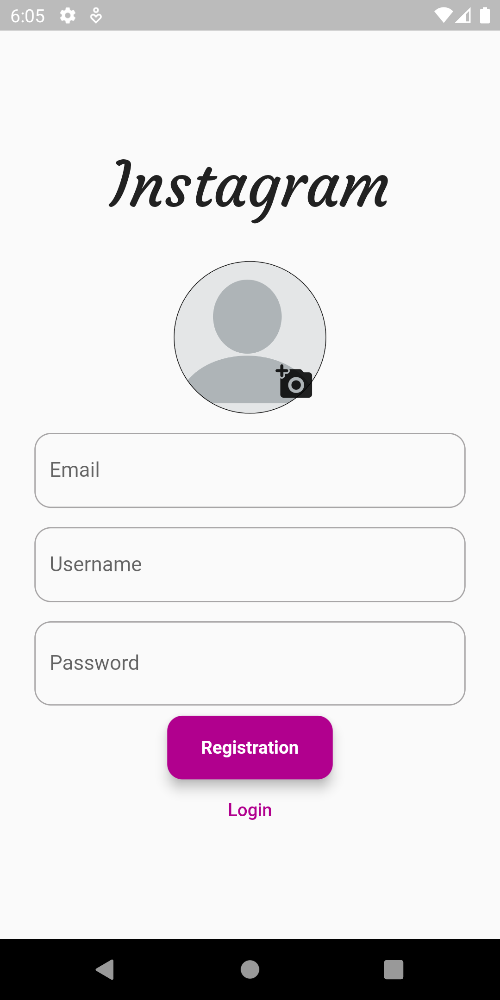

# Social App

## Technologies Used

- Flutter: A UI toolkit for building natively compiled applications for mobile, web, and desktop from a single codebase.
- Firebase: A comprehensive platform that provides various backend services, including authentication, database, storage, and more.
- Provider: A state management solution that helps manage and update app state efficiently.
- Other Flutter packages:
  [ cloud_firestore,
  firebase_auth,
  firebase_messaging,
  firebase_ui_auth,
  firebase_storage,

  provider,
  intl,
  image_picker,
  uuid,
  video_player,
  flutter_instagram_storyboard,
  animated_splash_screen]
  

## Installation

1. Clone this repository
2. Navigate to the project directory
3. Install dependencies: `flutter pub get`
4. Set up Firebase (Add New Project To Firebase): [https://console.firebase.google.com/u/0/]
5. Run the app: `flutter run`

## App Demo
(loading...)

## Screenshots

  
  
  

## Contact

For any inquiries, please contact [apurv.kvbr2@gmail.com].

Happy coding!
